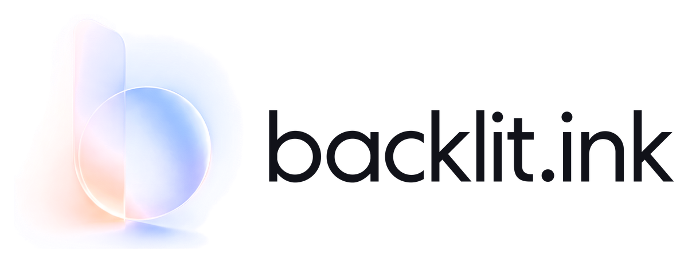

  <picture>
    <source media="(prefers-color-scheme: dark)" srcset="lockup-on-dark.png">
    
  </picture>

<b>The NFT market on Robinhood Chain where the sale price stays private.</b>

  <a href="https://backlit.ink">Website</a> ·
  <a href="https://backlit.ink/docs">Docs</a> ·
  <a href="https://backlit.ink/status">Status</a> ·
  <a href="https://x.com/backlitink">X</a>

 

Sellers list an NFT and accept sealed offers. Each sale settles in one
transaction, and only the buyer, the seller and the creator can read the price.
The creator's royalty is paid in full on every sale.

### Repositories

| | |
| --- | --- |
| [**protocol**](https://github.com/backlit-ink/protocol) | Solidity contracts, Noir circuits and the TypeScript SDK that runs in your browser. MIT licensed. |

### Robinhood Chain

| Contract | Address |
| --- | --- |
| Pool | [`0x3e56C8b1c68659fadAd0d0809Da55A1f126f57a2`](https://robinhoodchain.blockscout.com/address/0x3e56C8b1c68659fadAd0d0809Da55A1f126f57a2) |
| Market | [`0x50534f8de6ECc5971c480a93a7a9A6Fd999a74Ee`](https://robinhoodchain.blockscout.com/address/0x50534f8de6ECc5971c480a93a7a9A6Fd999a74Ee) |
| Backlit Panes | [`0x5B4ce9d0faC41f51137802C3Fb388937E907bE7b`](https://robinhoodchain.blockscout.com/address/0x5B4ce9d0faC41f51137802C3Fb388937E907bE7b) |

The contracts cannot be upgraded. Source is verified on Sourcify, and each
deployment's block, commit and toolchain are recorded in
[`contracts/deployments`](https://github.com/backlit-ink/protocol/tree/main/contracts/deployments).

### Security

Report a vulnerability privately through
[GitHub](https://github.com/backlit-ink/protocol/security/advisories/new). Please
do not open a public issue. We reply within three working days.
