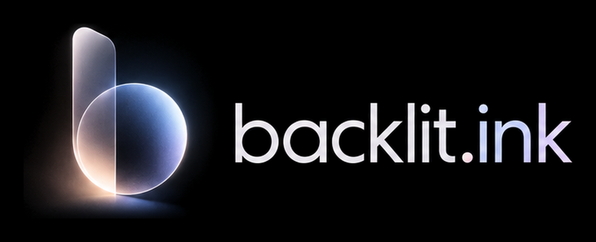

  

Sell an NFT on Robinhood Chain without publishing the price.

---

On Backlit, only the buyer, the seller and the creator know what an NFT sold
for. Each sale settles in one transaction with the creator's royalty paid in
full, and leaves a public receipt showing the new owner.

Live on Robinhood Chain at [backlit.ink](https://backlit.ink), and on testnet at
[testnet.backlit.ink](https://testnet.backlit.ink). Deployed addresses are in
[`contracts/deployments/`](https://github.com/backlit-ink/protocol/tree/main/contracts/deployments).

### Open source

**[protocol](https://github.com/backlit-ink/protocol)** holds the contracts,
the zero-knowledge circuits and the client cryptography. Backlit's contracts
cannot be upgraded, and nothing in them can pause a withdrawal.

### Links

[backlit.ink](https://backlit.ink) · [Threat model](https://github.com/backlit-ink/protocol/blob/main/docs/threat-model.md) · [Report a vulnerability](https://github.com/backlit-ink/protocol/security)
